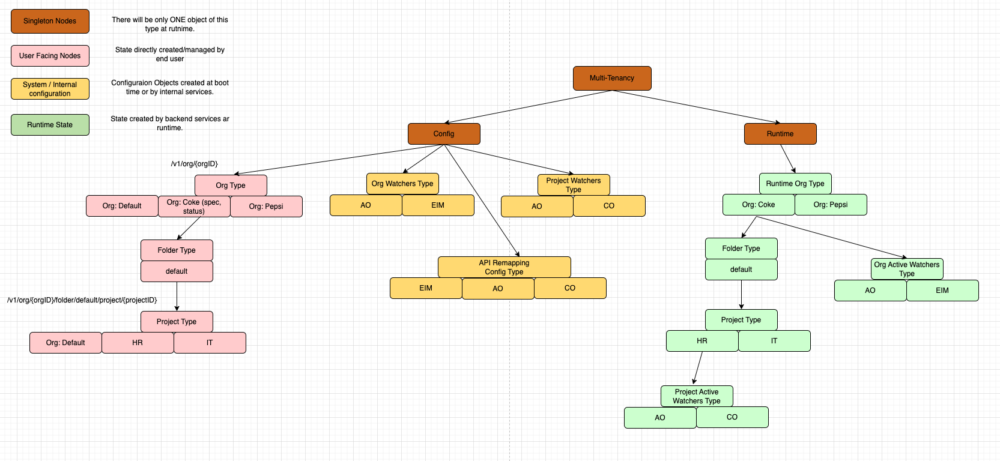
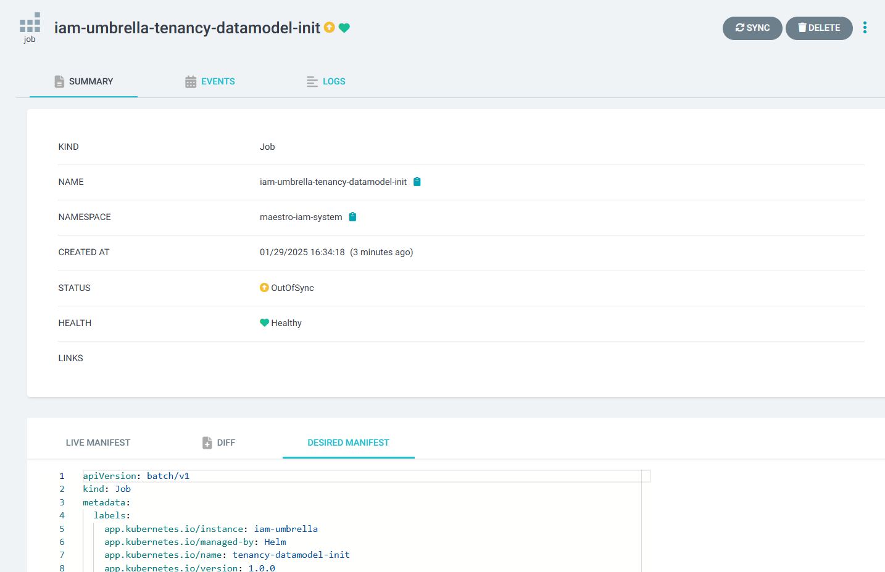

<!---
 Copyright (C) 2025 Intel Corporation

 Licensed under the Apache License, Version 2.0 (the "License");
 you may not use this file except in compliance with the License.
 You may obtain a copy of the License at

     http://www.apache.org/licenses/LICENSE-2.0

 Unless required by applicable law or agreed to in writing,
 software distributed under the License is distributed on an "AS IS" BASIS,
 WITHOUT WARRANTIES OR CONDITIONS OF ANY KIND, either express or implied.
 See the License for the specific language governing permissions
 and limitations under the License.

 SPDX-License-Identifier: Apache-2.0
-->

# Tenancy Datamodel Overview

The structure of the multitenancy datamodel is illustrated in the diagram below:



This diagram provides a clear visual representation of how the nodes and their relationships are structured to support multitenancy.

Note: This image is subject to change as updates to the tenancy datamodel may occur over time.

## Get Started

To define the datamodel, **Nexus** is used. Nexus is a powerful framework that simplifies the declaration of
datamodel nodes and types using Golang syntax. It provides a clear and intuitive way to define how different entities
within the multitenancy model are connected and interact with one another.

## Develop

- For detailed guidance on defining the DSL and understanding the purpose of each Nexus annotation, refer to the [DSL documentation](DSL_README.md).

- Tenancy-Datamodel is developed in the **Go** language and is built as a Docker image through a `Dockerfile` in
  the `tenancy-datamodel` folder.

- Tenancy-Datamodel has a corresponding Helm chart in the `charts/tenancy-datamodel` folder.
  The CI integration for this repository will publish these Helm charts to
  the Edge Orchestrator Release Service OCI registry upon merging to the `main` branch.

- Tenancy-Datamodel, when deployed to the Edge Orchestrator using this Helm chart,
  runs as a job to install the CRDs whose lifecycle is managed by Argo CD.

## Build

Once the DSL has been defined, follow these steps to generate the necessary components of the datamodel:

1. Run the following command in your terminal:

   ```bash
   make datamodel_build
   ```

   This command processes the defined DSL and generates the following artifacts:

   - [**CRD YAML files**](build/crds) with OpenAPI schema definitions for Kubernetes CRDs.
   - [**Go type definitions**](build/apis) for the CRDs.
   - [**Go client libraries**](build/nexus-client) for interacting with the CRDs.
   - [**ClusterRoles**](build/clusterroles), which define the permissions required for managing the resources
     in a Kubernetes cluster.

2. Once the datamodel is built, review the generated files for changes.
   These may include updates to CRD definitions, Go type files, and other artifacts.

3. Commit the updated DSL and the `build/*` directory with the generated changes.

## Upgrade

Follow the steps below to upgrade the datamodel in the cluster:

1. Scale down the components dependent on the tenancy-datamodel.

   For example:

   ```bash
   kubectl scale deploy nexus-api-gw -n orch-infra --replicas=0
   ```

2. Delete the CRDs: If the CRDs are [backward incompatible](#backward-incompatibility), it is essential to complete
   this step before proceeding to Step 3 to avoid potential conflicts and ensure a clean update process.

   Run the following command to delete the CRDs:

   ```bash
   kubectl get crds -o name | grep edge-orchestrator.intel.com | xargs kubectl delete
   ```

3. Copy the desired manifest of the `tenancy-datamodel` job from the Argo UI.

   

4. Update the image tag to the desired image version and apply the updated job.

   ```bash
   kubectl apply -f dm-job.yaml
   ```

5. Follow the steps to retrigger the API mapping job in the Argo UI.
   - Navigate to the Applications tab in the Argo UI.
   - Locate the tenancy-api-mapping job.
   - Click on Sync to retrigger the job.

   Note: This step is crucial because both tenancy-datamodel and tenancy-api-mapping jobs are essential
   for the API Gateway to return to a running state.

6. Scale up the components.

   For example:

   ```bash
   kubectl scale deploy nexus-api-gw -n orch-infra --replicas=1
   ```

By following these steps, you can ensure a smooth and efficient datamodel upgrade process within your cluster environment.

### Backward Incompatibility

Backward incompatibility occurs when changes to the datamodel make it incompatible with previous versions.
This can cause errors or failures in services that depend on the datamodel if they are not updated accordingly.
Examples of backward-incompatible changes include:

- Removing existing fields or nodes.
- Changing the data type of field.
- Renaming fields or nodes.

One way to detect backward incompatibility is to scan for the following log:

```log
time="2025-01-29T18:09:39Z" level=warning msg="CRD \"orgs.org.edge-orchestrator.intel.com\" is incompatible with the previous version"
```

## Contribute

We welcome contributions from the community!
To contribute, please open a pull request to have your changes reviewed and merged into the `main` branch.

Additionally, ensure the following commands are successful:

```shell
make datamodel_build
make lint
make license
make build
```
NOTE: Please note that `make build` command is for generating the docker image of Tenancy Datamodel.
